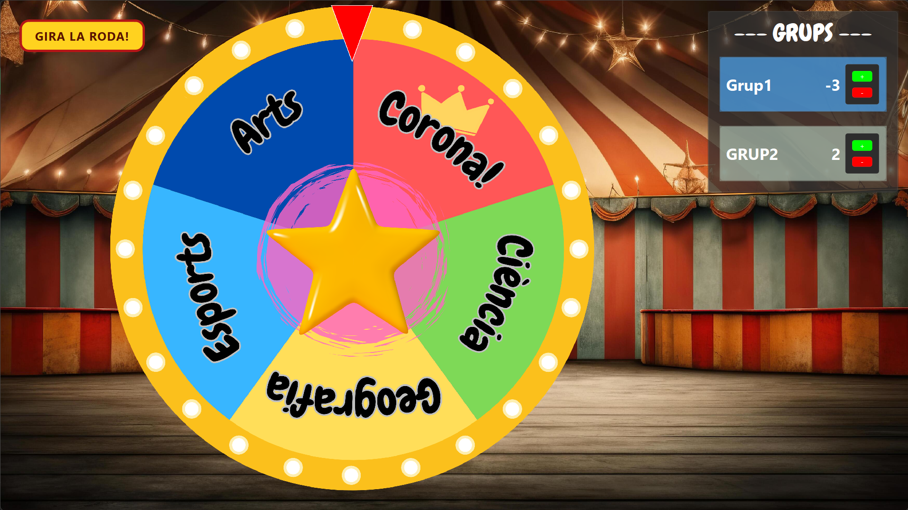

# Ruleta

A small app I built quickly for a summer camp activity. I’ve since cleaned up the code and added a few features to make it dynamically customizable.

## Features
- Customizable roulette and background.
- Customizable sounds.
- In-app timer as a non-modal dialog.
- Dynamically add new players and keep track of points.

### Note on how to customize the roulette itself:
The roulette wheel itself is nothing more than a simple spinning JPG image. I made a version that draws it programmatically so it would be dynamically customizable, automatically adding text and icons to each slice, but making it look good required more effort than it was worth, especially for the text in the slices. The code is still commented inside `WWheel.cpp`. Nowadays, you can easily create a better-looking wheel image in minutes with Canva or an AI image tool and load it to personalize the actual trials pointed to by the roulette.

## Controls

Exit full-screen mode to access the menu, or use the keyboard shortcuts:

| Key | Action                       |
| --- | ---------------------------- |
| `T` | Open the timer               |
| `M` | Create a new team            |
| `R` | Remove the last created team |

## Fair Warning

The kids, or players in general, may eventually end up hating the song. You can change it, try to soften the damage with jokes, or fully commit: wake them up the next morning with the song at full volume, as I did, and keep ninja-playing it for the rest of the summer camp.

## Screenshot

